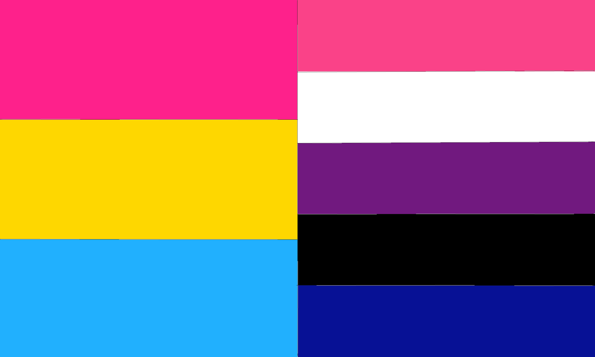
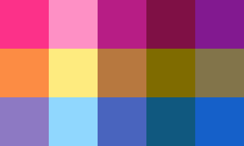

# Color Mean

A tool for finding the mean of two color hex codes

---

## My pride flags - side by side:

## My pride flags - crossed into a plaid:

[Azi's Little Helpers](../MeetupStuff/README.md)
